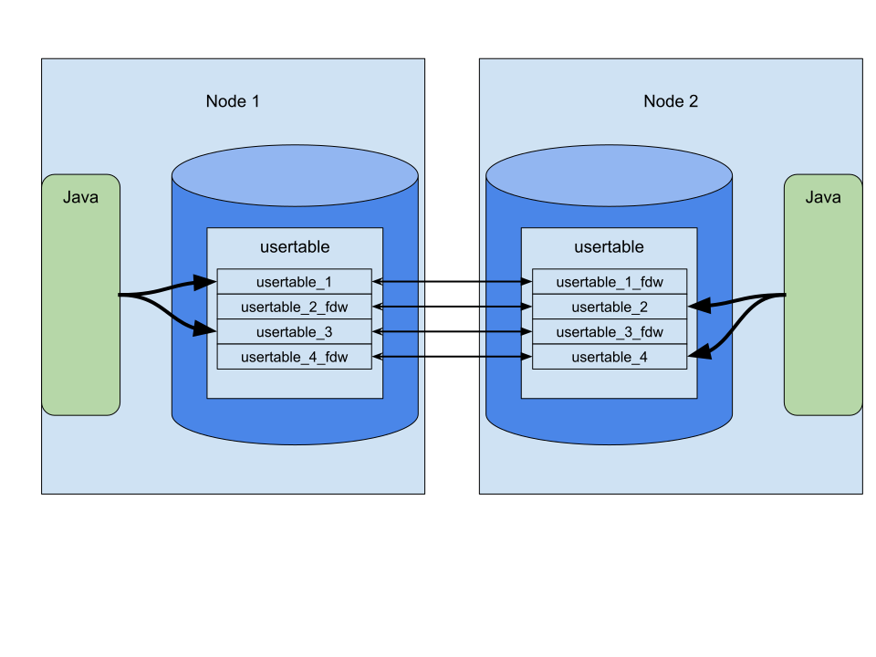

## О Проекте
Проект создан для быстрой загрузки тестовых данных в распределенной реляционной СУБД [Shardman](https://postgrespro.ru/products/shardman).
## Как это работает

При запуске автоматически создаются необходимые таблицы.

### Основная таблица для тестовых данных
В таблице usertable будут храниться тестовые данные. Она создается с помощью следующего SQL-запроса:
```sal
CREATE TABLE IF NOT EXISTS usertable(
    YCSB_KEY VARCHAR(64) PRIMARY key
  , FIELD0 VARCHAR(100)
  , FIELD1 VARCHAR(100)
  , FIELD2 VARCHAR(100)
  , FIELD3 VARCHAR(100)
  , FIELD4 VARCHAR(100)
  , FIELD5 VARCHAR(100)
  , FIELD6 VARCHAR(100)
  , FIELD7 VARCHAR(100)
  , FIELD8 VARCHAR(100)
  , FIELD9 VARCHAR(100)
  ) with (distributed_by='ycsb_key', num_parts=$PARTITION_CNT)
```

### Таблица для мониторинга
В таблицу monitoring_insert записывается информация о процессе вставки данных.
Каждые 5 минут в нее добавляются данные о количестве вставленных строк в таблицу usertable:
```
create table monitoring_insert(
  ts timestamp,
  shard int,
  val bigint
);
```
Для достижения высокой скорости загрузки данных используется параллельная вставка: 
в каждой ноде Shardman`а запускается отдельный экземпляр приложения, что позволяет эффективно вставлять данные именно в эту ноду не используя [FDW](https://postgrespro.ru/docs/enterprise/15/postgres-fdw).


## Как собрать
```
mvn package
```
Результат сборки в ./target/mbench_fast_load_to_shardman-1.0-SNAPSHOT-jar-with-dependencies.jar

## Как запустить

Параметры, которые нужно задать перед запуском:

Переменные окружения:

- SHARD_CNT - Задаёт количество нод
- PARTITION_CNT - Задаёт общее количество секций для секционированной таблицы
- BENCH_RUN_AFTER - Задаёт начальный id с которого будем генерировать. Если его не указать, то он будет высчитываться из таблицы monitoring_insert как: (select max(val) from monitoring_insert) - 20 000 000
- ROW_LIMIT - Задаёт лимит строк. По умолчанию 800 000 000 000
- В PATH обязательно должен быть путь до psql

Аргументы приложения:
- -U Пользователь, который подключается к СУБД
- -P Пароль, с которым пользователь подключается к СУБД
- -d Имя базы данных
- -h Хост СУБД
- -w Количество параллельных воркеров, на одной ноде
- -v номер ноды: 0 <= v < SHARD_CNT. Важный параметр, поскольку именно с помощью него определяются записи для текущей ноды
- -t Ограничение времени выполнения (в секундах). Генерация остановится, когда будет достигнут лимит времени или ROW_LIMIT.

Пример:
```
export SHARD_CNT=7
export PARTITION_CNT=70
java -Xmx512M -cp ./target/mbench_fast_load_to_shardman-1.0-SNAPSHOT-jar-with-dependencies.jar tests.YahooLoader -U postgres -P shardman-petabyte-scale-2025 -d postgres -w 40 -v 1 -t 43200 -h localhost
```

## Перезапуск

Процесс java можно остановить в любой момент.

Однако, чтобы избежать лишней работы, рекомендуется:
- Дождаться появления новой записи в таблице monitoring_insert
- Сразу после появления записи остановить процесс java
- Запустить генерацию заново по инструкции выше
